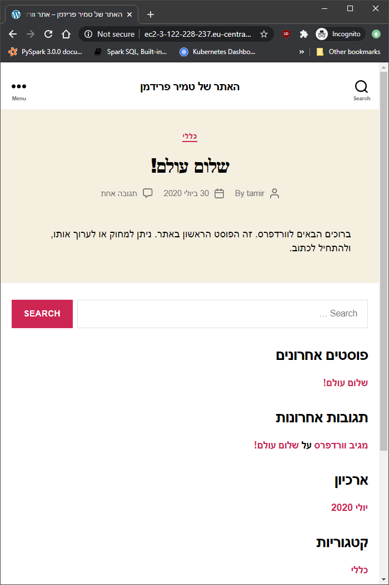

# ass12
repo used for terraform

```shell
tamir@DESKTOP-RIR353L:~/ass12$ aws ec2 run-instances --image-id ami-079024c517d22af5b --count 1 --instance-type t2.micro --security-group-ids launch-wizard-1 --key-name awskeypair
```
> RunInstances
|  OwnerId                      |  447436375177                             |
|  ReservationId                |  r-062046e28dc63c8ca                      |
> Instances
|  AmiLaunchIndex        |  0                                             |
|  Architecture          |  x86_64                                        |
|  ClientToken           |  c7429d95-a830-4ef2-bdfb-5449563a535a          |
|  EbsOptimized          |  False                                         |
|  Hypervisor            |  xen                                           |
|  ImageId               |  ami-079024c517d22af5b                         |
|  InstanceId            |  i-092d999e99d91019e                           |
|  InstanceType          |  t2.micro                                      |
|  KeyName               |  awskeypair                                    |
|  LaunchTime            |  2020-07-30T14:33:48.000Z                      |
|  PrivateDnsName        |  ip-172-31-45-7.eu-central-1.compute.internal  |
|  PrivateIpAddress      |  172.31.45.7                                   |
|  PublicDnsName         |                                                |
|  RootDeviceName        |  /dev/sda1                                     |
|  RootDeviceType        |  ebs                                           |
|  SourceDestCheck       |  True                                          |
|  StateTransitionReason |                                                |
|  SubnetId              |  subnet-b3b97fcf                               |
|  VirtualizationType    |  hvm                                           |
|  VpcId                 |  vpc-267ede4c                                  |
> CapacityReservationSpecification
|  CapacityReservationPreference                          |  open       |
> CpuOptions
|  CoreCount                                            |  1            |
|  ThreadsPerCore                                       |  1            |
> MetadataOptions
|  HttpEndpoint                                   |  enabled            |
|  HttpPutResponseHopLimit                        |  1                  |
|  HttpTokens                                     |  optional           |
|  State                                          |  pending            |
> Monitoring
|  State                      |  disabled                               |
> NetworkInterfaces
|  Description        |                                                 |
|  InterfaceType      |  interface                                      |
|  MacAddress         |  06:47:2b:f0:90:74                              |
|  NetworkInterfaceId |  eni-0780ed3a1730d16b5                          |
|  OwnerId            |  447436375177                                   |
|  PrivateDnsName     |  ip-172-31-45-7.eu-central-1.compute.internal   |
|  PrivateIpAddress   |  172.31.45.7                                    |
|  SourceDestCheck    |  True                                           |
|  Status             |  in-use                                         |
|  SubnetId           |  subnet-b3b97fcf                                |
|  VpcId              |  vpc-267ede4c                                   |
> Attachment
|  AttachTime                |  2020-07-30T14:33:48.000Z              |
|  AttachmentId              |  eni-attach-086ca79e0a28a3220          |
|  DeleteOnTermination       |  True                                  |
|  DeviceIndex               |  0                                     |
|  Status                    |  attaching                             |
> Groups
|  GroupId              |  sg-007206605faa0cd27                       |
|  GroupName            |  launch-wizard-1                            |
> PrivateIpAddresses
|  Primary          |  True                                           |
|  PrivateDnsName   |  ip-172-31-45-7.eu-central-1.compute.internal   |
|  PrivateIpAddress |  172.31.45.7                                    |
> Placement
|  AvailabilityZone                   |  eu-central-1b                  |
|  GroupName                          |                                 |
|  Tenancy                            |  default                        |
> SecurityGroups
|  GroupId               |  sg-007206605faa0cd27                        |
|  GroupName             |  launch-wizard-1                             |
> State
|  Code                       |  0                                      |
|  Name                       |  pending                                |
> StateReason
|  Code                            |  pending                           |
|  Message                         |  pending                           |
